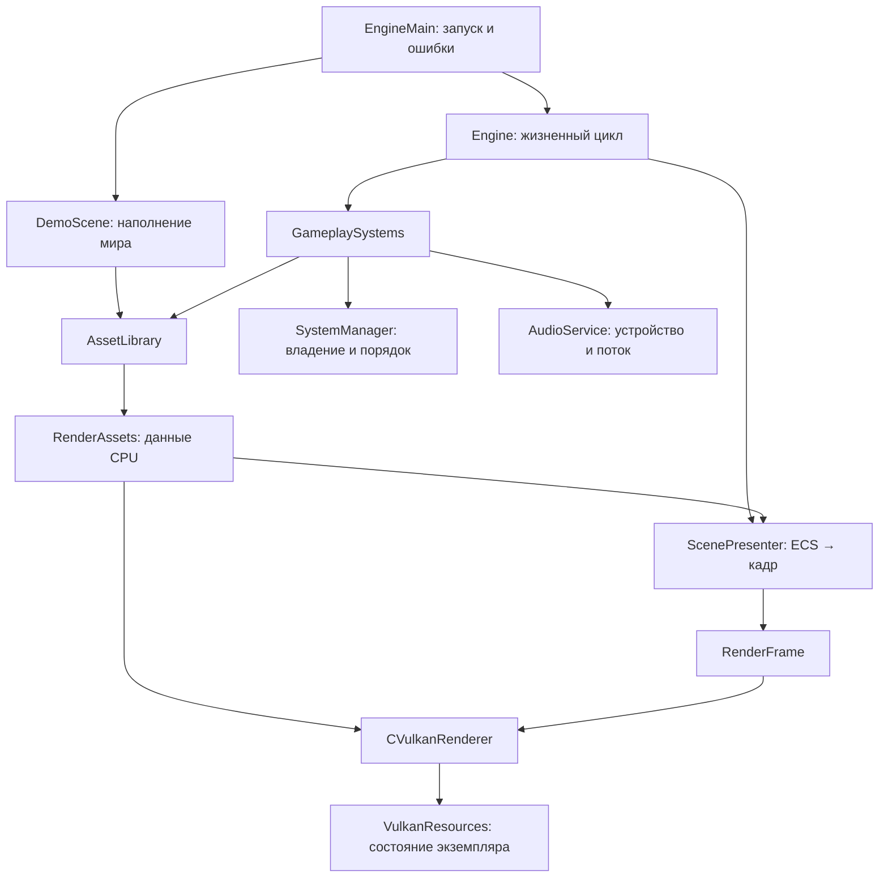

# Архитектура после рефакторинга

`Engine` — фасад приложения и координатор цикла. Он больше не загружает glTF,
не собирает материалы и не управляет отдельными системами через сырые указатели.
Публичный заголовок не включает Vulkan и платформенные окна.



## Обязанности

| Модуль | Ответственность |
| --- | --- |
| `src/Engine.cpp` | События, последовательность обновления, запуск и остановка |
| `src/Demo/DemoScene.cpp` | Содержимое демонстрационной сцены |
| `src/Assets/AssetLibrary.cpp` | Регистрация ресурсов, хранение путей, OBJ/glTF, границы моделей, геометрия шрифта |
| `src/Runtime/GameplaySystems.cpp` | Состав и порядок систем, передача времени и ввода |
| `src/SystemManager.cpp` | Владение системами и включение по экземпляру |
| `src/Runtime/AudioService.cpp` | Устройство, поток, передача ошибки и join перед закрытием |
| `src/Rendering/ScenePresenter.cpp` | Преобразование компонентов ECS в кадр |
| `src/Rendering/SceneTransforms.cpp` | Камера, анимация, матрицы света и интерфейса |
| `include/Rendering/RenderTypes.hpp` | Геометрия и структуры сцены без Vulkan |
| `include/Rendering/RenderFrame.hpp` | Данные кадра; рендерер получает `const`-ссылку |
| `src/GraphicAPI/Vulkan.cpp` | Жизненный цикл backend и пересоздание swapchain |
| `src/GraphicAPI/VulkanDevice.cpp` | Устройство, поверхность, конвейеры |
| `src/GraphicAPI/VulkanMemory.cpp` | Изображения, буферы, память, загрузка геометрии |
| `src/GraphicAPI/VulkanDescriptors.cpp` | Дескрипторы и uniform buffers |
| `src/GraphicAPI/VulkanFrame.cpp` | Сборка и отправка кадра, синхронизация |
| `src/GraphicAPI/VulkanOverlay.cpp` | Текст, инвентарь, HUD, отладочные проходы |
| `src/GraphicAPI/VulkanShadows.cpp` | Проходы теней |
| `src/GraphicAPI/RenderConfig.cpp` | Конфигурация проходов и дескрипторов |

## Владение

Экземпляр `Engine` создаётся в области видимости приложения. Нормальное завершение
и исключение освобождают его ресурсы. `GameKill()` оставлен как необязательная
идемпотентная остановка. Один экземпляр поддерживает один запуск `GameLoop()`.

Планировщик владеет системами через `unique_ptr`. Ссылки, возвращаемые `add<T>()`,
стабильны при добавлении систем. Повторное выключение не создаёт дублирующих
записей. Открытие инвентаря выключает движение, а не генератор уровня, который
занимает первый индекс списка.

`AudioService` владеет backend и потоком. Устройство открывается до запуска
потока и закрывается после `join`. Ошибка `SoundStream()` передаётся в главный
поток через `exception_ptr`. Методы управления сервисом вызываются из главного
потока; звуковые запросы отправляются через backend.

`RenderAssets` и `RenderFrame` живут дольше рендерера. Подготовка кадра заканчивается
перед `draw()`, рабочие задачи рендерера завершаются перед следующим изменением
кадра. Сцена не пишет в GPU handles; они закрыты внутри backend.

Таблицы конвейеров, проходов, дескрипторов и их CPU-записи принадлежат
`VulkanResources` каждого рендерера. Глобальные таблицы и статические счётчики
сборщиков устранены. Временные shader modules освобождаются через RAII, включая
отказ создания pipeline. Очистка учитывает частичную инициализацию.

## Изменения API

Вместо `Engine::GetInstance()`, ручного `GameKill()` и `delete`:

```cpp
GLVM::core::Engine engine;
GLVM::demo::populateScene(engine);
engine.GameLoop();
```

Методы регистрации текстур и мешей сохранены. Внутренние методы подготовки матриц
и загрузки файлов перенесены из публичного API `Engine` в соответствующие модули.
Генератор получает `AssetLibrary&` через конструктор.

Вместо глобального менеджера и отключения по числовому индексу используются
локальный `CSystemManager`, `add<T>()` и `setEnabled(system, bool)`. Доступ к GPU
заменён методами рендерера; `window()`, `extent()` и `frame()` нужны циклу приложения
и диагностике. Vulkan vertex input перенесён из `Vertex` в `VulkanVertexLayout`.

Регистрация файлов заканчивается перед подготовкой ресурсов. Текущий импортёр
требует регистрировать OBJ перед glTF: нарушение теперь выдаёт ошибку вместо
несовпадения mesh ID с геометрией. Пути копируются в каталог — временная строка
больше не оставляет висячий указатель. Память из `LoadTextureFromAddress` пока
заимствуется и должна жить до загрузки.

## Сборка и проверки

`MakefileLin` создаёт `build/libglvm.a`, затем связывает демосцену и текстуры с
библиотекой в `build/linGame`. `Run-GLVM.cmd` и `scripts/run.sh` сохранены.

```bash
make -f MakefileLin -j4
make -f MakefileLin test
python3 tests/check_shaders.py
```

`make test` включает прежние регрессии контейнеров, ECS, JSON и аудио, новые
проверки владения и остановки, а также проверку отсутствия Vulkan в публичных
и CPU-заголовках.

Графические проверки требуют Wayland и Vulkan:

```bash
bash tests/gpu_smoke.sh
python3 tests/renderer_probe.py
python3 tests/initialization_failure.py
```

Для установленного здесь Mesa llvmpipe проверки LeakSanitizer запускаются с
закреплённым модулем драйвера, чтобы его внутренние кеши оставались видимыми:

```bash
export LD_PRELOAD=/usr/lib/x86_64-linux-gnu/libvulkan_lvp.so
export VK_DRIVER_FILES=/usr/share/vulkan/icd.d/lvp_icd.json
```

`renderer_probe` проверяет два resize, инвентарь через события и отображение
коллизий. `initialization_failure` проверяет неверный лимит кадров, отсутствие
драйвера и принудительный отказ pipeline после создания устройства. Проверки
используют ASan/UBSan и Vulkan validation.

## ECS и пространственная сетка

`Engine` владеет `World`; мир владеет менеджером ID и чанками. Системы получают
`World&` в конструкторе (`WorldSystem`), сцена доступна через `engine.world()`.
Глобального мира и singleton `ArchetypeEntityManager` больше нет. Границы мешей
принадлежат `RenderAssets` и передаются в сетку/коллизии через конструкторы.
Несколько CPU-миров имеют независимые ID, компоненты и пространственные индексы.

Архетип регистрирует каждый массив через `registerComponent<Id>(array)`.
Это одновременно задаёт маску, фактическую ёмкость, перенос и очистку компонента.
`World::addEntityToArchetype()` ищет свободный чанк того же типа либо создаёт его
через `cloneEmpty()`. После добавления нужно брать фактический чанк и индекс из
`entityLocations[getId(entity)]`. `removeEntity()` обновляет перенесённую сущность,
отсоединяет пространственные связи и освобождает ID. Результат `query(mask)` —
динамический список всех чанков. `findArchetype(mask)` выбирает первый непустой
чанк (или пустой шаблон); он предназначен для создания объектов/активного UI.

`core::vector` теперь только адаптер прежнего API над `std::vector`: памятью,
копированием, перемещением и временем жизни управляет стандартная библиотека.
`clear()` сохраняет ёмкость. Инвентарь тоже использует стандартные контейнеры.

Сетка хранит обратные ссылки из сущности в ячейки и обновляет членство только
после изменения позиции, масштаба или mesh ID. Обход трансформов остаётся линейным
по числу сущностей, полный обход и очистка 32³ ячеек каждый кадр устранены.
Сетка статическая: куб от -512 до +512 по каждой оси, частичные пересечения
обрезаются, полностью внешние и нечисловые координаты не индексируются.
Коллизии используют AABB с масштабированным центром меша; вращение AABB и
непрерывное обнаружение столкновений пока не реализованы.

## Оставшиеся границы

Очередь платформенного ввода и событие пока общие для процесса. Независимые
CPU-миры поддерживаются, одновременные интерактивные окна движка не заявлены.
Старые `ComponentManager`/`EntityManager` сохранены для совместимости старого кода;
активный игровой цикл использует архетипный ECS.

Проверяются Wayland/Vulkan и Win32/Vulkan. X11/XCB, OpenGL и сетевой режим
сохранены как устаревшие реализации без гарантии работоспособности.
Единая точка сборки — корневой `Makefile`, профили `CONFIG=Debug`/`Release`.
Исторические Makefile теперь перенаправляют в неё; CI собирает Linux и Windows.
